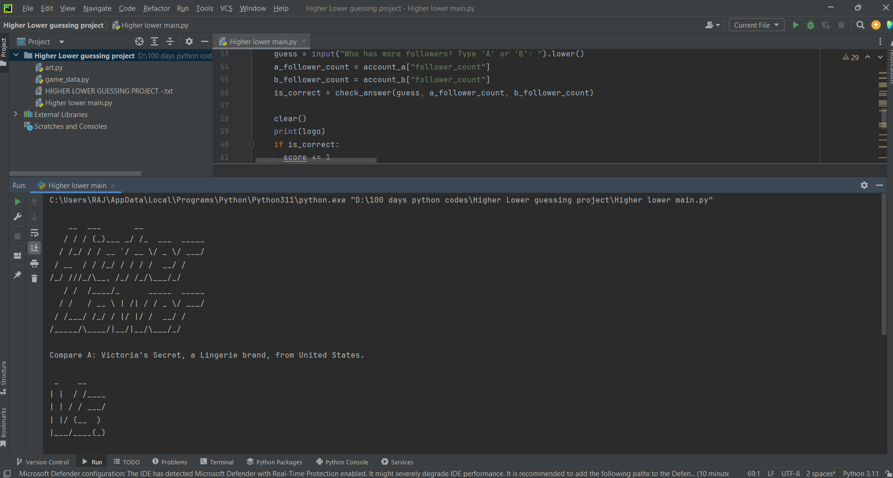

# HIGHER LOWER GUESSING PROJECT :-

 - Overview:-

The Higher or Lower Game is a simple, text-based game where the player is presented with two randomly chosen accounts from a dataset. Each account includes a name, a description, a country, and a follower count. The player must guess which of the two accounts has more followers. The game continues until the player guesses incorrectly, and the final score is displayed at the end.

Code Explanation:

# 1 . Imports:
 
import random
from replit import clear
from art import logo, vs
from game_data import data

~ random: Used to randomly select accounts from the dataset.

~ replit.clear: Clears the console output to enhance the user experience.

~ art: Contains ASCII art for the game logo and the "vs" symbol.

~ game_data: Contains the dataset of accounts, each with a name, description, country, and follower count.

# 2 . Functions:

- get_random_account 

def get_random_account():
  """Get data from random account"""
  return random.choice(data)

~Purpose: Returns a random account from the data list.

~Parameters: None

~Returns: A randomly selected account dictionary.

- format_data

def format_data(account):
  """Format account into printable format: name, description and country"""
  name = account["name"]
  description = account["description"]
  country = account["country"]
  return f"{name}, a {description}, from {country}"

~Purpose: Formats the account information into a readable string.

~Parameters: account (dictionary) - The account to format.

~Returns: A formatted string containing the account's name, description, and country.

- check_answer

Purpose: Compares the follower counts of two accounts and checks if the user's guess is correct. 
  
 - Parameters:
  ~guess (string) - The user's guess ("a" or "b").
  ~a_followers (int) - Follower count of account A.
  ~b_followers (int) - Follower count of account B.
  ~Returns: True if the guess is correct, False otherwise.

# 3 . Main Game Function:

- game

def game():
  print(logo)
  score = 0
  game_should_continue = True
  account_a = get_random_account()
  account_b = get_random_account()

  while game_should_continue:
    account_a = account_b
    account_b = get_random_account()

    while account_a == account_b:
      account_b = get_random_account()

    print(f"Compare A: {format_data(account_a)}.")
    print(vs)
    print(f"Against B: {format_data(account_b)}.")
    
    guess = input("Who has more followers? Type 'A' or 'B': ").lower()
    a_follower_count = account_a["follower_count"]
    b_follower_count = account_b["follower_count"]
    is_correct = check_answer(guess, a_follower_count, b_follower_count)

    clear()
    print(logo)
    if is_correct:
      score += 1
      print(f"You're right! Current score: {score}.")
    else:
      game_should_continue = False
      print(f"Sorry, that's wrong. Final score: {score}")

- Purpose: Runs the main game loop.
~ Steps:
  ~Prints the game logo.
  ~Initializes the score and a flag (game_should_continue) to control the game loop.
  ~Selects two random accounts to start.
  ~Enters a loop that continues until the user guesses incorrectly:
  ~Assigns account_b to account_a and selects a new account_b.
  ~Ensures the new account_b is not the same as account_a.
  ~Prints the formatted data for both accounts.
  ~Prompts the user for a guess.
  ~Checks if the guess is correct and updates the score or ends the game based on the result.
  ~Clears the console and prints the logo again for the next round.

# 4 . Running the Game:

To run the game, simply execute the game() function. The game will start, displaying the logo and asking the user to compare the follower counts of two accounts.

game()

# 5 . Conclusion: 
This documentation provides an overview of the Higher or Lower game, including the main components and their functions. By understanding each part of the code, you can modify or extend the game as needed. The game is designed to be simple yet entertaining, offering a quick challenge based on guessing social media popularity.

# 6 . OUTPUT :

<h1 align="center">
 <a href="https://google.com">
    
   
    
</h1>

